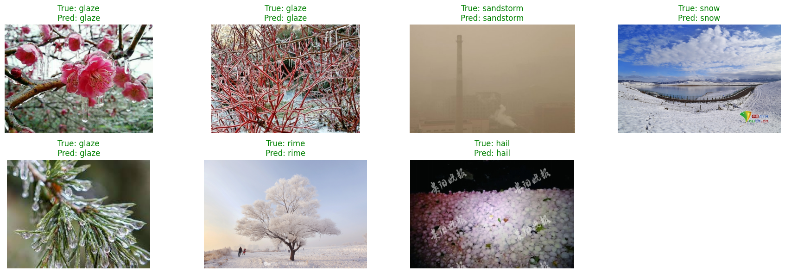

# Weather Detection Model 

This project presents a **weather image classification model** developed using PyTorch and EfficientNetV2-S. It's designed to accurately identify various weather conditions (such as clear, cloudy, foggy, or rainy) from images through a **deep learning approach**. The model has been rigorously trained and evaluated on the [Weather Image Recognition dataset from Kaggle](https://www.kaggle.com/datasets/jehanbhathena/weather-dataset).

## Table of Contents

1.  [Features](https://www.google.com/search?q=%23features)
2.  [Setup Instructions](https://www.google.com/search?q=%23setup-instructions)
      - [Run Locally (PC)](https://www.google.com/search?q=%23run-locally-pc)
      - [Run on Google Colab](https://www.google.com/search?q=%23run-on-google-colab)
3.  [Model Details](https://www.google.com/search?q=%23model-details)
      - [Download Trained Model](https://www.google.com/search?q=%23download-trained-model)
      - [Accuracy Table](https://www.google.com/search?q=%23accuracy-table)
4.  [Inference Example](https://www.google.com/search?q=%23inference-example)
      - [Visualization of Predictions](https://www.google.com/search?q=%23visualization-of-predictions)
5.  [References](https://www.google.com/search?q=%23references)

## Features

  * **Weather Classification:** Detects various weather conditions (clear, cloudy, foggy, rainy, etc.) in images.
  * **Deep Learning Powered:** Utilizes a PyTorch-based EfficientNetV2-S model for high accuracy.
  * **Kaggle Dataset:** Trained and validated on the comprehensive Weather Image Recognition dataset.

## Setup Instructions

### Run Locally (PC)

Follow these steps to set up and run the project on your local machine:

1.  **Clone the Repository:**
    ```bash
    git clone <your-repository-url>
    ```
2.  **Install Dependencies:** Ensure you have Python 3.7+ installed. Install the required packages using pip:
    ```bash
    pip install -r requirements.txt
    ```
3.  **Download Dataset:**
    Download the [Weather Image Recognition dataset](https://www.kaggle.com/datasets/jehanbhathena/weather-dataset) from Kaggle and extract its contents into a directory of your choice (e.g., `data/weather_dataset`).
4.  **Download Trained Model Weights:**
    Download the pre-trained model weights (`efficientnet_v2_s_weather.pth`) from the [Download Trained Model](https://www.google.com/search?q=%23download-trained-model) section below. Save this file in your project root directory or update the `model_path` variable in your script to its location.
5.  **Configure Paths:**
    Update the `data_dir` and `model_path` variables in your Python scripts (e.g., `train.py`, `inference.py`) to point to the correct locations of your dataset and model weights.

### Run on Google Colab

For a cloud-based setup, use Google Colab:

1.  **Open a New Notebook:** Go to [Google Colab](https://colab.research.google.com/) and create a new Python 3 notebook.
2.  **Install Packages:** Run the following command in a Colab cell to install necessary libraries:
    ```python
    !pip install torch torchvision opendatasets kagglehub
    ```
3.  **Download Dataset:** Use the Kaggle API to download the dataset directly into your Colab environment:
    ```python
    import kagglehub

    # Download latest version of the dataset
    path = kagglehub.dataset_download("jehanbhathena/weather-dataset")

    print("Path to dataset files:", path)
    ```
4.  **Upload Model Weights:** Upload the `efficientnet_v2_s_weather.pth` file directly to your Colab session, or mount your Google Drive and navigate to the model file's location.
5.  **Update Paths:** Adjust any file paths in your Colab notebook code to reflect the locations of the dataset and model weights within the Colab environment.

## Model Details

  * **Model Name:** EfficientNetV2-S (`efficientnet_v2_s_weather.pth`)
  * **Framework:** PyTorch (`torchvision`)
  * **Classifier:** Features a custom linear layer tailored for the specific weather dataset classes.

### Download Trained Model

You can download the pre-trained `efficientnet_v2_s_weather.pth` model weights from the link below:

  * [Download EfficientNetV2-S Weather Model Weights (efficientnet\_v2\_s\_weather.pth)](https://www.google.com/search?q=https://your-link-here/model.pth)
    *(**Note:** Please replace `https://your-link-here/model.pth` with the actual public download link for your `.pth` file.)*

### Accuracy Table

| Model Name                      | Test Accuracy | Download Link                                        |
| :------------------------------ | :------------ | :--------------------------------------------------- |
| `efficientnet_v2_s_weather.pth` | 97.20%        | [Download](https://www.google.com/search?q=https://your-link-here/model.pth)         |

## Inference Example

### Visualization of Predictions

Below is a sample prediction result grid generated by the model. Each image displays its true and predicted labels, with color indicating the correctness of the prediction.



This plot is generated by the inference code available in this repository and visually represents the model's actual predictions against the ground truth labels. To generate new results, simply re-run the inference notebook or script and update the image if necessary.

## References

  * **Weather Image Recognition Dataset:** [Kaggle Dataset Link](https://www.kaggle.com/datasets/jehanbhathena/weather-dataset)
  * **Kaggle API Dataset Download Instructions:** [YouTube Video - How to Download Kaggle Dataset using API](https://www.youtube.com/watch?v=krkS9u140tM)
